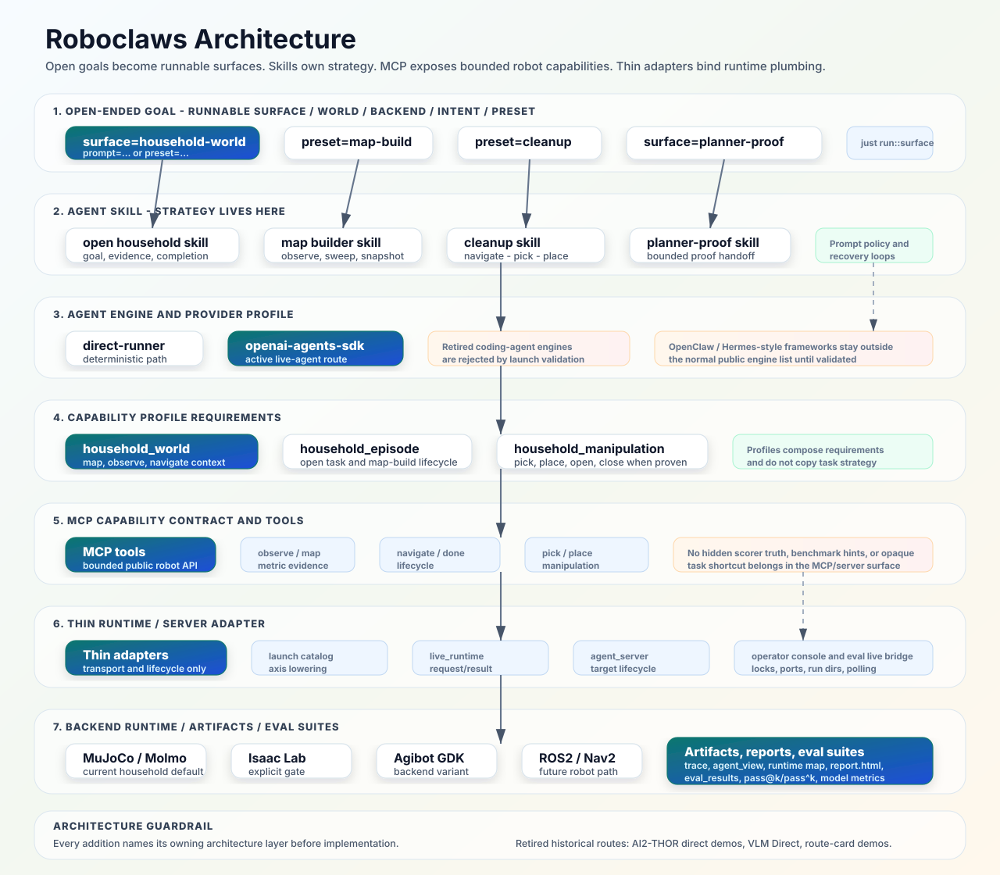

# Architecture

Roboclaws is a thin robotics demo repo. Its architecture goal is not to hide
robot work behind one opaque tool; it is to make every run reviewable through
public surface, prompt/preset inputs, MCP tool traces, maps, reports, and
private-evaluation boundaries.

For commands, start with [`README.md`](README.md). For the
surface/preset/skill/profile model, read
[`docs/human/mcp-skills-and-semantic-profiles.md`](docs/human/mcp-skills-and-semantic-profiles.md).



## Core Model

The current human-facing layers are:

```text
Open-ended goal
  -> Runnable Surface, World / Scene, Intent, and optional Preset
  -> Agent Skill
  -> Agent Engine and Provider Profile
  -> Capability Profile requirements
  -> MCP Capability Contract and Tools
  -> Thin Runtime / Server Adapter
  -> Backend Runtime / Environment Primitive
  -> Artifacts, reports, and eval suites
```

Evaluation is a first-class maintainer layer beside product runs, not a
replacement for the launch surface:

```text
Product run
  just run::surface ...

Eval harness
  just agent::eval recommend|execute ...
  Selects and runs deterministic gates, product rows, eval suites, live-agent
  evals, blocked evidence, and regression-promotion guidance for a plan, diff,
  or explicit request.

Eval suite
  Versioned capability benchmark artifact under the facade: samples, trials,
  graders, aggregate metrics, failure classes, and replayable regression
  evidence.

Eval Evolution
  Campaign-bound optimizer, candidate, selection, isolation, and human-only
  promotion contracts under the eval facade. Skill and MCP candidates are
  content-addressed and cannot mutate the checkout during evaluation.

Package proof CLIs
  Specialist runners and probes owned by the package that implements the
  behavior. Eval rows may invoke these owners without a second command registry.
```

- **Runnable Surfaces And Presets** are public run contracts such as
  `surface=household-world prompt=...`,
  `surface=household-world preset=map-build`,
  `surface=household-world preset=cleanup`, and
  `surface=planner-proof intent=planner-proof`. They own command names,
  parameters, report shape, and acceptance gates.
- **Worlds / Scenes** are operator-facing rooms, maps, or digital twins such as
  `world=molmospaces/procthor-10k-val/0`, `world=agibot-g2/map-12`,
  `world=b1-map12`, or `world=planner-proof/default`.
- **Backend Runtimes** are execution adapter ids such as `backend=mujoco`,
  `backend=isaaclab`, or `backend=agibot-gdk`. Product support is
  world-scoped: MolmoSpaces household scenes use MuJoCo, B1 / Map 12 uses
  Isaac Lab, and Agibot map runs use Agibot GDK.
  `roboclaws.launch.executor` consumes the resolved typed launch plan once and
  owns adapter dispatch and child lifecycle; product callers do not reconstruct
  private commands. The launch catalog stores canonical axes, goal metadata,
  scenario setup, and relocation count directly on `LaunchPlan`;
  `LaunchPlan.adapter_options` contains adapter-specific options only. Environment
  export and report rerun commands derive canonical state from the typed plan
  instead of reparsing string copies.
- **Agent Skills** own strategy: prompts, scripts, examples, recovery loops,
  and trace-preserving routines such as `navigate -> pick -> place`.
- **Agent Engines And Provider Profiles** distinguish the product runtime
  (`agent_engine=openai-agents-sdk` for live agents, or `direct-runner` for
  deterministic proof) from the
  model/key route (`provider_profile=codex-responses`, `mimo-responses`,
  `minimax-responses`, or `kimi-openai-chat`). Codex and MiMo use separate
  environment-owned endpoint, key, and request-model triples while sharing the
  standard Responses model path. Their internal routes are eligible on both the
  local workstation and CloudML. Kimi and MiniMax use external routes and eval
  only from the local workstation; provider rows carry this as
  `provider_network_scope` plus fail-closed `allowed_execution_targets`
  manifest fields. A thin Codex-only HTTP compatibility adapter
  supplies required ephemeral request metadata and omits unsupported default
  settings; artifacts retain only public profile/model labels.
  Retired live engines `codex-cli` and `claude-code` are rejected by current
  launch validation rather than preserved as compatibility aliases.
  `direct-runner` is the deterministic contract/eval baseline, not a live robot
  agent runtime.
  Other engine values are ordinary unsupported inputs; the active contract has
  no gateway, local-container, compatibility, or deprecated-command route. The
  maintained product shape is the OpenAI Agents SDK live route plus
  deterministic direct-runner proof.
  `roboclaws.agents.household_live_runner` owns the active OpenAI Agents SDK
  household lifecycle and imports its reusable budget, continuation, metrics,
  performance-profile, and status helpers from package modules.
- **Capability Profiles** define reusable capability environments. Skills
  require profiles; profiles should not be copied into task-specific supersets.
- **MCP Capability Contract And Tools** are the stable public robot interface:
  observe, navigate, map, pick, place, done, and related bounded capabilities.
  MCP is where public capability contracts and tool-order validation responses
  belong; task strategy should stay in skills unless behavior has met the MCP
  promotion rule.
- **Thin Runtime / Server Adapters** bind the MCP transport and lifecycle:
  fixed server targets, host/port, readiness, pid/lock files, output dirs,
  live-agent status, operator-console launch control, and eval live-run polling.
  They are plumbing, not a behavior layer. They must not own cleanup/search/map
  strategy, private scoring truth, benchmark-specific hints, or opaque
  multi-tool task shortcuts.
- **Backend Runtimes / Environment Primitives** execute environment-specific
  actions behind the public MCP contract. Backend variants stay in metadata and
  adapters, not in public task names.
- **Eval Suites** are repo-owned benchmarks that run selected product surfaces
  through versioned samples, deterministic graders, optional advisory graders,
  aggregate metrics such as `pass@k` / `pass^k`, and failure replay. Their first
  maintainer facade is `just agent::eval ...`.
- **Eval Evolution** is the bounded candidate-improvement control plane inside
  `roboclaws.evals`. Optimizer and robot live roles use OpenAI Agents SDK with
  distinct identities. MCP behavior candidates receive only trusted
  baseline-public JSON through a credential-scrubbed, no-network, read-only
  worker boundary; provider access and durable artifacts stay in the trusted
  process. Promotion is digest-bound and human-only.
- **Experiment Telemetry** is the dependency-free, closed-schema boundary owned
  by `roboclaws.agents.experiment_telemetry`. Local run artifacts remain the
  canonical evidence. The optional `PhoenixTelemetryAdapter` exports sanitized
  OpenInference spans asynchronously and fail-open to a loopback-only Phoenix
  service; prompt content is represented only by immutable Git, Skill, and
  rendered-prompt digests. Phoenix cannot schedule, authorize, or gate product
  or eval execution. The maintainer-only `phoenix-project` command reads an eval
  suite and optional existing result bundle to project datasets, experiments,
  and annotations; it never launches providers, simulators, CloudML, or
  hardware work.

Runtime Map Prior evaluation separates artifact production from consumption:

```text
MapBuild quality matrix
  -> accepted selector report
  -> explicit maintainer promotion
  -> immutable content-addressed canonical prior
  -> no-prior controls + parallel fixed-prior provider consumers
```

The normal provider baseline never rebuilds MapBuild inside each provider cell.
No-prior controls start directly from the Base Metric Map, while fixed-prior
consumers receive one explicit read-only canonical artifact and record its
digest. Same-provider MapBuild plus consumer execution remains an explicit
end-to-end research profile, not the default comparison matrix.

The real-robot rule is: physical runs should reuse the same surface, intent,
skill, profile, and MCP tool layers. They differ by backend variant,
provenance, safety gates, operator map context, and blocked-capability status.

## Major Stacks

Roboclaws currently centers on the household-world demo stack. Retired demos
may still appear in historical plans or archived reports, but they are not
current public launch axes and should not be revived without a new architecture
decision.

### Household World And Cleanup

This stack proves household world understanding, semantic cleanup, runtime maps,
and future physical robot parity.

Key pieces:

- `roboclaws/household/household_runtime_contract.py` owns the public/private
  household runtime contract.
- `roboclaws/household/agent_view.py` owns the sectioned Agent View v2 boundary
  for public household-world agent inputs, saved `agent_view.json` artifacts,
  live agent-facing responses, and sidecar public-evidence guards.
- `roboclaws/household/household_world_episode.py` owns the direct deterministic
  household episode used by the launch surface and eval harness.
- `roboclaws/household/semantic_cleanup_loop.py` owns the direct semantic
  cleanup flow.
- `roboclaws/maps/` owns reusable navigation map artifacts, projections, and
  Runtime Map Prior Snapshot behavior. `runtime_prior_contracts.py` owns the
  shared schemas/privacy keys; `runtime_prior_snapshot.py` wraps online runtime
  maps; `runtime_prior_conversion.py` converts Agibot and Nav2 sources;
  `runtime_prior_artifact.py` reads persisted priors;
  `runtime_prior_materialization.py` projects consumer targets; and
  `runtime_prior_source_validation.py` owns source/frame/digest validation.
- Planner proof behavior is split by ownership: `planner_proof_requests.py`
  builds bound requests and run manifests; `planner_proof_selection.py` and
  `planner_proof_fallback_selection.py` select current and fallback requests;
  `planner_proof_results.py` projects result summaries; and
  `planner_grasp_cache.py` plus `planner_grasp_cache_generation.py` own cache
  availability and generation preflights. Shared proof and feasibility schema
  names live in their focused contract modules.
- `roboclaws/household/household_mcp_server.py` exposes the profile-composed
  household MCP capability surface for SDK live agents and future higher-level
  MCP clients.
- `roboclaws/cli/household_agent_server.py` is the thin server adapter that
  assembles live household MCP server processes behind
  `python -m roboclaws.cli.agent_server ...`.
- Household reports are split by behavior. `report.py` composes cleanup
  reports; `report_tables.py` owns semantic and tabular projections;
  `report_document.py` assembles HTML and JavaScript;
  `report_styles.py` owns base and planner CSS; `report_planner.py` composes
  planner, proof-bundle, and grasp-cache reports; `report_snapshots.py` writes
  state images and trace JSONL; and `artifact_report.py` loads artifacts and
  rerenders cleanup reports. Current callers import these owners directly.
- `roboclaws/household/camera_control.py` owns the external render-camera
  request schema used by MuJoCo product runs and B1/generic Isaac probes.
- `roboclaws/backends/molmospaces/` owns the MolmoSpaces JSON worker runtime:
  protocol/dispatch, initialization/state, navigation/actions, and
  capture/perception. Its sole executable boundary is
  `python -m roboclaws.backends.molmospaces.worker`; household code invokes the
  module and does not resolve script paths.
- `roboclaws/backends/isaaclab/` owns the Isaac Lab JSON worker and generic
  runtime-smoke validation: protocol/state, initialization, navigation/actions,
  scene/robot capture, rendering diagnostics, checker policy, and B1 readiness,
  base-map proof augmentation, waypoint requests, navigation reproducibility,
  and navigation reporting. These run as package modules while Isaac
  dependencies remain isolated
  in `.venv-isaaclab/`. Harnesses derive prior Omniverse EULA acceptance from
  the machine-local `OMNI_KIT_ACCEPT_EULA=YES` environment contract; without
  it they do not accept by default, and an explicit false override still wins.
- `roboclaws/maps/b1_*.py` owns B1 base-map construction, reviewed alignment,
  semantic projection, and explicit promotion workflows. Current authoring
  tools consume these owners; accepted input assets remain review-controlled.
- `roboclaws/household/cleanup_validation*.py` owns cleanup artifact, schema,
  privacy, map, planner, robot-view, and backend structural validation. Product
  runs use `python -m roboclaws.household.cleanup_validation_cli` and never
  depend on eval code. `roboclaws/evals/cleanup_result_*` composes that product
  validation with benchmark-only advisory scoring for eval and harness rows.
- `roboclaws/household/agibot_sdk_runner.py` owns the Roboclaws-side Agibot
  SDK subprocess adapter, including conversion of SDK-local exports into the
  public household Agent View v2 artifact. The vendor runner at
  `vendors/agibot_sdk/tools/run_agibot_cleanup_backend.py` stays SDK-local.
- `roboclaws/household/agibot_physical_pilot.py` is the package CLI for the
  physical pilot. The typed launch executor invokes this module while retaining
  localization, run-enablement, E-stop, and explicit real-movement gates.
- `roboclaws/operator_console/` provides the standalone local agent operator
  console. It exposes explicit SDK/direct route metadata, per-backend locks,
  route gates, normalized live operator state, redacted raw-log access, and
  links to existing run artifacts. It starts catalog-approved runs and surfaces
  state; it does not own robot task strategy.

The operator-console browser client is native ES modules under
`roboclaws/operator_console/static/`. `app.js` is the composition entrypoint;
`state.js` is the sole mutable application-state owner, with workflow model and
view, launch, background-task, run-session, manual-control, visual-workspace,
and HTTP/DOM behavior owned by their named modules. The server serves only
root-level, non-hidden JavaScript assets from that static directory and marks
them no-store.

Runtime inventory is composed by `operator_console/runtime_inventory.py` from
four explicit owners: filesystem and runtime sources, canonical task/resource
payloads, route blocker policy, and host probes. Launcher, readiness, and
server callers import policy directly; the composition module owns only the
inventory and blocker payload assembly and is not a compatibility facade.

The OpenAI Agents SDK driver is composed by
`agents/drivers/openai_agents_live.py`. Run configuration, validated setting
values, retry behavior, provider racing, event logging and projection,
completed-tool history, RAW-FPV image memory, camera-grounded history, and
model-input compaction have direct behavior owners. The retired mixed
`openai_agents_model_input` owner is absent; tests and runtime callers import
the true owners while serialized event, cost, privacy, and result schemas stay
unchanged.

The household SDK launch adapter is `agents/household_live_runner.py`; direct
configuration, lifecycle, handoff, continuation, profile, and metrics owners
sit beside it. Current run inspection uses
`python -m roboclaws.agents.live_status_cli`; live-performance extraction reads
OpenAI Agents SDK telemetry only. Historical reports may retain serialized
retired-engine identity, but current reporting does not parse retired Codex CLI
or Claude Code event streams.

The retained household runtime is split by behavior rather than transport.
MCP response projection and artifact serialization, runtime-map target
selection, visual perception/navigation, direct cleanup target selection, and
Agibot SDK contract/projection/stage execution have direct household owners.
`household_backend_port.py` owns the typed boundary used by the synthetic,
MolmoSpaces, and Isaac Lab adapters. `HouseholdRuntimeContract` reaches those
adapters only through `HouseholdBackendSession`; the session keeps the concrete
adapter private and exposes canonical operations and a complete typed runtime
evidence snapshot. Runtime policy does not probe optional adapter fields or
retain a raw adapter escape hatch.
`household_mcp_server.py`, `household_world_episode.py`,
`realworld_runtime_map_targets.py`, `realworld_visual_candidate_lifecycle.py`,
and `agibot_sdk_runner.py` remain composition or adapter owners; they do not
re-export the extracted behavior. Public Agent View, MCP, runtime-map, privacy,
and physical-pilot safety contracts remain unchanged.

World discovery is owned outside launch. `roboclaws/worlds/contracts.py`
defines the recursively immutable `WorldSpec` consumed by the launch catalog,
and `roboclaws/worlds/molmospaces/` owns source catalog data, typed sampler
rows, deterministic sampling/profile/prefilter policy, source preparation,
scanner validation, and canonical map-bundle naming. `launch/worlds.py`
resolves cross-backend catalog entries and optional dependency status; it does
not own MolmoSpaces sampling behavior. Current package, script, skill, console,
eval, and test callers import the world owners directly.

Retained authoring, preview, probe, visual-grounding, and showcase scripts are
thin adapters over package owners. B1/Isaac authoring behavior lives under
`roboclaws.maps` and `roboclaws.backends.isaaclab`; planner probe/proof behavior
lives under `roboclaws.household`; scene previews live under
`roboclaws.operator_console`; visual-grounding service and benchmark behavior
live under `roboclaws.household.visual_grounding_sidecar` and
`roboclaws.evals.visual_grounding_benchmark`; showcase rendering lives under
`roboclaws.reports`. Package code never imports or executes script modules.

The clean-slate direction is:

- `surface=household-world preset=map-build` produces Runtime Metric Map
  snapshots, which can be wrapped as a Runtime Map Prior Snapshot for
  downstream task consumption.
- `surface=household-world preset=cleanup` runs cleanup.
- `surface=household-world prompt=...` runs the no-preset household open-task
  contract with agent-declared completion and public evidence.
- The canonical map flow is minimal-first: start from occupancy/free-space
  navigation context, run `preset=map-build`, then feed the resulting
  `runtime_metric_map.json` or `runtime_map_prior_snapshot.json` to
  cleanup with `runtime_map_prior=...` when a prior sweep is useful.
- Offline Agibot `navigation_memory.json` conversion happens at the map-artifact
  boundary and produces the same Runtime Map Prior Snapshot contract;
  cleanup and open household tasks should not add Agibot-only loading branches.
- `household_world` is the reusable world-understanding capability profile.
- Manipulation capability should be composed as a separate requirement when a
  skill needs `pick`, `place`, `open_receptacle`, or `close_receptacle`.

## Public Command Surface

The public command grammar is intentionally small:

```bash
just run::surface surface=<surface> agent_engine=<engine> [world=<world>] [backend=<backend>] [intent=<intent>] [provider_profile=<profile>] [key=value ...]
```

Examples:

```bash
just run::surface surface=household-world world=molmospaces/procthor-10k-val/0 backend=mujoco preset=map-build agent_engine=openai-agents-sdk provider_profile=kimi-openai-chat evidence_lane=camera-grounded-labels camera_labeler=grounding-dino scenario_setup=baseline seed=7
just run::surface surface=household-world world=molmospaces/procthor-10k-val/0 backend=mujoco preset=cleanup agent_engine=direct-runner evidence_lane=world-public-labels scenario_setup=relocate-cleanup-related-objects seed=7
just run::surface surface=household-world world=molmospaces/procthor-10k-val/0 backend=mujoco agent_engine=openai-agents-sdk provider_profile=kimi-openai-chat prompt="find something useful to drink"
just run::surface surface=planner-proof world=planner-proof/default backend=mujoco intent=planner-proof agent_engine=direct-runner mode=dry-run
just console::run
```

The maintained Just surface contains only `run::surface`, `agent::eval`,
`agent::verify`, and `console::run`.
Specialist proofs use package CLIs directly. Python launch code owns typed
product execution; there is no private Just target registry or second command
dispatch loop.

Backend availability is validated against the selected world. MolmoSpaces
household worlds expose `backend=mujoco`; `backend=isaaclab` is current for
`world=b1-map12`, not as a MolmoSpaces alternative.

For household runs, callers pass the cleanup input/evidence lane explicitly as
`evidence_lane=...`.
`evidence_lane` decides what the agent sees. Supported current lanes are
`world-public-labels`, `camera-grounded-labels`, and `camera-raw-fpv`.
`camera-grounded-labels` additionally requires `camera_labeler=...`; the
default deployment-like producer is `grounding-dino`, with `yoloe`,
`yolo-world`, and `omdet-turbo` available for comparison. `camera_labeler` is
invalid for world-label and raw-FPV lanes. The `smoke` token remains a cheap
synthetic preset, not an evidence lane.

Cleanup lanes do not select online/offline map behavior. The default
start-of-run map context is the Base Metric Map: occupancy geometry,
generated exploration candidates, and public room-category hints when
available. Use `runtime_map_prior=...` to consume a raw runtime map or canonical
Runtime Map Prior Snapshot prior. Historical `minimal` / `rich` map
artifacts may still be readable, but current product docs should not ask
operators or agents to choose those modes.

The clean-slate household public shape is `surface=household-world` plus a
natural-language prompt or an optional preset. `preset=map-build` produces Runtime Metric Map evidence,
`runtime_map_prior_snapshot_v1` is the canonical downstream artifact
contract, and `preset=cleanup` consumes household-world evidence for cleanup.
Older task/profile names such as `semantic-map-build`, `household-cleanup`,
and Molmo-specific profile names are historical/report-only terms, not the
canonical task layer or active compatibility contract.

`just console::run` starts a standalone local operator console for supported
SDK/direct household routes. The main console screen is a workflow surface:
choose a scene, inspect scene/map-prior state, then run Build Map, Open Task, or
Cleanup. Runtime Map Prior Snapshot use is an optional workflow setting backed
by the scene recommended-prior catalog or an operator override, not a separate
top-level "with map" task. Scene preparation actions such as standard mess
setup and reset are setup/operations controls, not robot-task workflow peers.
Operator workflows default to `evidence_lane=camera-grounded-labels` with
`camera_labeler=grounding-dino`; simulator/public-label lanes, provider
selection, relocation count, and other raw launch axes are Advanced controls.
Environment-specific support differences should appear as capability/readiness
state on the same workflow surface. B1 / Map 12 digital-twin Build Map is an
experimental Isaac-runtime-gated route; digital-twin cleanup stays unavailable
until product cleanup execution is proven. Agibot G2 physical cleanup stays
unavailable until physical manipulation proof exists. The console does not
expose arbitrary shell commands: workflow launches still translate into
`just run::surface` args and resolve through the public launch catalog.

Operator Console long interaction is modeled as **Operator Session chaining**,
not as one persistent agent process. A Robot Run remains one auditable episode:
after `done` or any terminal status, its report, checker result, and artifacts
are fixed. While a Robot Run is active, new operator text is `Steer Current Run`
and must be consumed through `check_operator_messages`; active-run queued next
goals are rejected. During an explicit paused handoff, operator text is
`Resume With Prompt`. After a terminal parent, `Next Goal` starts a linked child
Robot Run in the same Operator Session. The child kickoff prompt may receive a
sanitized public `next_goal_packet` containing the session id, parent run id,
parent public summary, and public artifact links. Private scorer truth,
generated mess truth, acceptable destinations, private manifests, and global
movable-object inventories must not be injected into follow-up context.
Normalized active and terminal run phases are owned by
`roboclaws.operator_console.state_summary`; launcher, inventory, interaction,
and control consumers do not keep local phase taxonomies.

## Evaluation Layer

Eval suites answer whether a household or planner-proof capability is improving
over time. A suite is made of versioned samples; each sample resets an
environment, runs one or more agent trials, records traces and artifacts, grades
state/outcome, trajectory, privacy, artifacts, and efficiency, then aggregates
metrics and failure classes.

Eval suites must preserve the same public/private boundary as product runs.
Private generated mess sets, acceptable destinations, hidden target lists, and
scorer truth remain grader inputs or private report evidence; they do not become
MCP profile metadata, skill instructions, or agent-facing tool responses.
Cleanup evals should treat a `static_fixture_projection` MCP call as a trajectory violation
because current cleanup MCP servers no longer expose that tool. Historical
`static_fixture_projection` artifact fields may remain readable for map bundles, reports,
and compatibility checks.

The first implementation is intentionally repo-native under `evals/` and
`roboclaws/evals/`. The schema layer defines `eval_suite`, `eval_sample`,
`eval_trial`, and `eval_result` packets plus direct-runner fixtures; the first
deterministic runner is exposed as `just agent::eval suite=smoke_regression
budget=smoke`. Do not add a third-party eval framework until deterministic
household suites have proven the sample, artifact, grader, privacy, and result
packet contracts that Roboclaws needs.

Eval execution is composed by `evals/runner.py`. Suite loading, trial
execution, live process execution, live product policy, artifact/privacy/
outcome grading, open-ended grading, grader source handling, failure/result
projection, result persistence, and aggregation/reporting have direct owners.
`evals/cli.py` imports only the runner from the eval package; the runner
composes suite execution and CLI tool-mode dispatch without a reverse import
or compatibility facade.

The maintained orchestration facade is `eval-harness`, exposed through
`just agent::eval recommend|execute|suite|promote-regression`. It supersedes the
old separate `agent-validation-matrix` entrypoint. Eval-harness manifests use
`roboclaws_eval_harness_manifest_v1` and may link maintainer-only private
artifacts, but must not inline private scorer truth, hidden targets, acceptable
destinations, generated mess sets, private manifests, or raw provider logs.

Live eval execution is opt-in. Non-direct eval requests can record blocked
identity/preflight packets without launching real providers; `live_execution=run`
is the explicit switch that runs the selected product route. Provider/runtime
failures are classified separately from agent behavior failures.

The Operator Session live eval is:

```bash
just agent::eval session-live budget=smoke \
  agent_engine=openai-agents-sdk provider_profile=<profile> live_execution=run
```

It drives the headless operator-console API through parent start, active-run
Steer, terminal parent, Next Goal child launch, sanitized child follow-up
context, and child terminal status. Missing provider keys, SDK packages, ports,
or runtime gates are blocked evidence, not agent behavior failures.

## Capability Profiles

`roboclaws/mcp/profiles.py` defines current MCP capability metadata. The
household head is `household_world`, composed with
`household_episode` for no-preset open tasks and map-build, and with
`household_manipulation` for cleanup skills.
Older backend/domain ids such as `molmospaces_cleanup_v1` and
`real_robot_cleanup_v1` are historical/report-only artifact terms, not active
selectable capability profiles.

Going forward:

- Add a new runnable surface or preset by adding a domain `tasks.py` spec and
  registering it in `roboclaws/launch/catalog.py`; keep behavior in the domain
  package.
- Add a new world or scene in `roboclaws/launch/worlds.py`, and expose only
  operator-facing ids such as room, map, or digital-twin names.
- Add a new backend runtime in `roboclaws/launch/backends.py` as a reusable
  adapter boundary; implementation backend ids stay private metadata.
- Add a new agent engine in `roboclaws/launch/agent_engines.py`. For live
  agent engines, shared launcher and status semantics should flow through
  `roboclaws/agents/live_runtime.py`, with task-specific kickoff text in
  `roboclaws/agents/prompts/`.
- Add or revise thin server adapters only for transport and lifecycle concerns:
  MCP server target routing, host/port, readiness, locks, run directories,
  live status, operator-console run control, or eval live-run polling. If the
  change needs task strategy or multi-step behavior, put it in a skill first or
  promote it through the MCP capability contract only after the boundary is
  stable.
- Add or revise MCP tools in the domain-local MCP module when the capability
  surface is stable enough to reuse across skills.
- Profiles describe reusable capability environments, not whole tasks.
- Skills compose profiles by requirement; profiles should not copy other
  profiles' tool lists.
- Backend variants belong in metadata/config, not in public task names.
- Private relocation/generated mess sets, acceptable destinations, hidden target lists,
  private manifests, and private scorer truth must not appear in public profile
  metadata or agent-facing inputs.

## Runtime Artifacts

Every serious run should produce reviewable evidence:

- `trace.jsonl` for tool calls and state transitions.
- `agent_view.json` / `run_result.json` for public agent-facing state. Current
  household Agent View artifacts use `schema=agent_view_v2` with task,
  capabilities, Base Metric Map, Runtime Metric Map, active perception,
  policy, readiness, and privacy sections.
- `model_call_metrics.jsonl` for sanitized per-call model-work rows when the
  live OpenAI Agents SDK route exposes compatible usage or timing telemetry.
- `roboclaws_report_performance_metrics_v1` packets, usually produced by the
  report-performance extractor, for maintainer comparisons of quality,
  call-count work, model work, normalized-estimate availability, and residual
  latency.
- `cleanup_backend_evidence` inside `run_result.json` for normalized backend
  provenance, runtime-metadata attachment status, diagnostic availability,
  robot evidence, and artifact keys. Backend-specific legacy sections such as
  `molmospaces_runtime` and `isaac_runtime` remain available for specialized
  reports and checkers.
- `runtime_metric_map.json` when a run builds or updates household world
  evidence.
- `runtime_map_prior_snapshot.json` when online runtime-map output or
  offline Agibot navigation memory is packaged for downstream household tasks.
- `report.html` for human review.
- Optional planner-proof bundles when cleanup substeps are checked against
  local RBY1M/CuRobo proof.
- Eval-suite outputs under `output/evals/<suite>/<stamp>/`, including
  `eval_results.json` and an eval report that links back to underlying product
  run artifacts.

Phoenix is the supported generic trace and experiment browser, but it does not
replace these local artifacts. The Phase 5 parity review retained local span
JSONL for budgets, continuation, usage fidelity, and offline audit; local
performance projection for provider-neutral metrics; same-or-better comparison
for product-quality policy; and domain eval reports for regrade and selection.
No standalone generic operator-console trace browser existed to delete.

The artifact boundary matters: public agent evidence and private scoring truth
must remain separate. Reports may display both, but agent inputs and MCP
profiles must not leak private evaluator data.

## Real-Robot Boundary

Real-robot work is incremental:

1. Prove public map context and observation.
2. Prove bounded navigation to operator-approved waypoints or backend-verified
   goals.
3. Keep manipulation as `blocked_capability` until physical proof exists.
4. Promote physical manipulation only when reports can show provenance, safety
   gates, and failure modes.

Agibot G2 is the current physical backend variant under the same public
task/profile shape as simulator and digital-twin runs. ROS2/Nav2 remains a
future backend candidate or historical proof path; do not advertise it as an
active launch backend until a catalog route and real operator proof exist.

## Where To Look

| Need | Start here |
| --- | --- |
| What to run | [`README.md`](README.md), [`just/README.md`](just/README.md) |
| Surface/intent/skill/profile design | [`docs/human/mcp-skills-and-semantic-profiles.md`](docs/human/mcp-skills-and-semantic-profiles.md) |
| Eval suites and validation boundaries | [`docs/human/evaluation.md`](docs/human/evaluation.md) |
| MolmoSpaces settings | [`docs/human/molmospaces-settings.md`](docs/human/molmospaces-settings.md) |
| Local runtime and keys | [`docs/human/local-runtime.md`](docs/human/local-runtime.md) |
| Current project focus | [`STATUS.md`](STATUS.md) |
| Detailed plans and evidence | `docs/plans/`, `docs/status/active/`, `docs/retrospectives/` |
